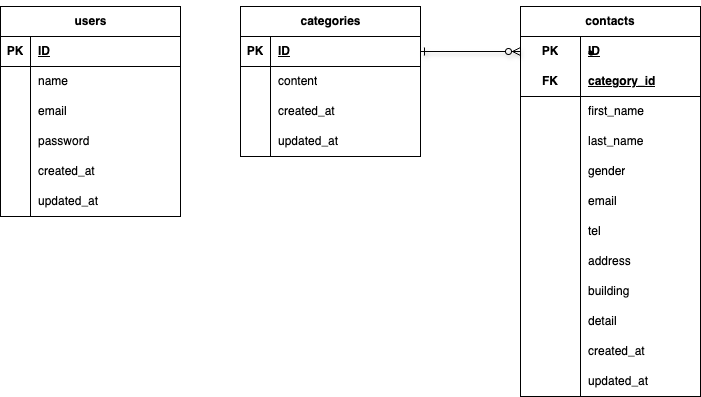

# お問い合わせフォーム

## 📦環境構築

### Dockerのビルド
```
git clone git@github.com:satomayuko/contact-form4.git
cd contact-form4
docker-compose up -d --build
```


### Laravel関連準備
```
docker-compose exec php bash
composer install

```

### .envファイルの作成と設定
```
cp .env.example .env
```
.env ファイルには以下のように設定します
```env
DB_CONNECTION=mysql
DB_HOST=mysql
DB_PORT=3306
DB_DATABASE=laravel_db
DB_USERNAME=laravel_user
DB_PASSWORD=laravel_pass
```
### データベースマイグレーション（Migration）
下記コマンドでマイグレーション、シーディングを実行します
```
docker-compose exec php bash
php artisan migrate
php artisan db:seed
```
### アプリケーションキーの生成
アプリケーションキーを生成し .env に自動設定します：
```
docker-compose exec php bash
php artisan key:generate
```

## 🔧 使用技術(実行環境)

- **PHP** 8.0.30(Dockerコンテナ内)
- **Laravel** 8.83.8
- **MySQL** 8.0.26
- **Docker**（環境構築用：nginx, php, mysql）

## 🗺 ER図


## 🌐URL
- 開発環境: http://localhost/
- 管理画面: http://localhost/admin
- ユーザー登録: http://localhost/register
- ログイン: http://localhost/login
- phpMyAdmin:（http://localhost:8080 でDB操作可能）